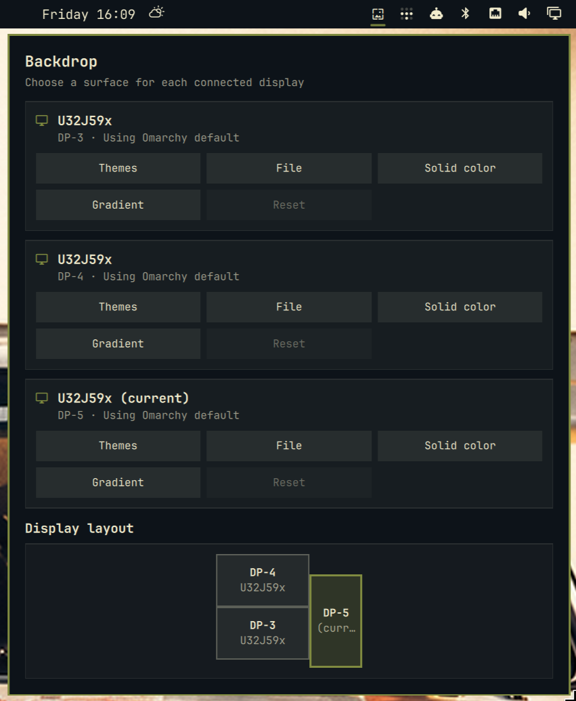

# Backdrop

**Different walls for every display.**

Backdrop is a multi-display wallpaper service for the Omarchy Quattro shell. It replaces Omarchy's stock background renderer while preserving the standard `background` IPC target and global wallpaper fallback.



## Current features

- Manage every connected display from an Omarchy bar widget.
- Assign a different image to each connected display.
- Browse backgrounds from every installed stock and user theme.
- Pick custom image files outside the Omarchy theme library.
- Assign solid colors using presets, custom hex values, or an on-screen color picker.
- Use any of the 382 uiGradients presets with a custom angle.
- Remember displays by manufacturer, model, and serial number when available.
- Fall back to the connector name and Omarchy's current global background.
- React to monitor hotplug through `Quickshell.screens`.

## Install

```bash
omarchy plugin add https://github.com/lgse/backdrop.git --enable
```

Plugins run as unsandboxed code inside `omarchy-shell`. Review third-party plugin code before enabling it.

## Use

Click the **Backdrop** icon in the Omarchy bar. Its panel lists every connected display with five actions:

- **Themes** browses backgrounds from all installed Omarchy themes.
- **File** opens an isolated native GTK file picker with filesystem navigation and image previews.
- **Solid color** offers presets, custom hex colors, and a screen picker powered by `hyprpicker`.
- **Gradient** provides an in-panel, scrollable gallery of all 382 uiGradients, common angle presets, and a custom-angle fallback.
- **Reset** returns that display to Omarchy's global background.

Assignments are stored in:

```text
~/.config/omarchy/backdrop/assignments.json
```

The plugin never modifies files under `/usr/share/omarchy`.

## IPC

Backdrop retains Omarchy's `background` IPC target and adds these methods:

```bash
omarchy-shell -q background setForScreen DP-3 /path/to/wallpaper.png
omarchy-shell -q background setColorForScreen DP-4 '#111318'
omarchy-shell -q background clearForScreen DP-3
omarchy-shell -q background assignments
```

A serial-backed key shown by `assignments` is preferred over a connector such as `DP-3` because connector names may change.

## Compatibility behavior

- `omarchy theme bg set` changes the fallback used by displays without an explicit assignment.
- Theme changes preserve explicit per-display assignments.
- The lock screen continues to use Omarchy's global current background.
- Disabling or removing Backdrop restores the stock `omarchy.background` service.

## Roadmap

- A spatial display-map editor.
- Group wallpaper results by theme.
- Optional hyprmoncfg profile and hotplug integration.
- Profile-specific wallpaper sets.
- Animated background transitions.

## Development

Requirements: Node.js and an installed Omarchy system for QML integration testing.

```bash
npm test
omarchy plugin validate .
```

## License

[MIT](LICENSE). Gradient names and colors are sourced from the MIT-licensed [uiGradients](https://uigradients.com/) project; see [third-party notices](THIRD_PARTY_NOTICES.md).
